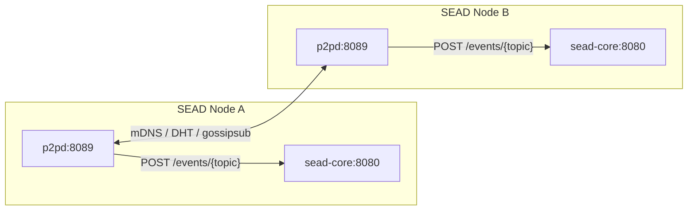

# Stardome SEAD P2P Discovery

**Decentralized peer discovery and pubsub fabric for SEAD nodes.** Provides mDNS
and Kademlia DHT discovery, gossipsub messaging, and a REST API for publishing
and subscribing to topics. Runs as a sidecar alongside each sead-service stack.

## Architecture



Each p2p node:
- Discovers other nodes via **mDNS** (LAN) or **Kademlia DHT** (multi-subnet)
- Provides a **gossipsub** pubsub fabric for opaque byte messages
- Exposes a **REST API** (`/health`, `/peers`, `/events/{topic}`, `/metrics`)
- Streams topic messages via **Server-Sent Events (SSE)**

## Deploy

### Prerequisites

- Docker + Docker Compose plugin
- A running SEAD stack (see [stardome-sead](https://github.com/Stardome-technology/stardome-sead))
- The p2p image is pre-built at `ghcr.io/stardome-technology/stardome-sead-p2p:latest` (multi-arch amd64 + arm64)

### Quick start

```bash
# Pull and run (uses host networking — see note below)
docker compose -f docker-compose.remote.yml pull
docker compose -f docker-compose.remote.yml up -d

# Verify
curl http://localhost:8089/health
```

> **Why host networking?** The container uses `network_mode: host` so that mDNS
> multicast packets reach the physical LAN interface — enabling zero-config peer
> discovery across machines without bootstrap configuration. The p2p sidecar is a
> lightweight daemon with no secrets or TLS, making host networking a safe choice.
> The container binds ports directly on the host's IPs; no `-p` port mapping is
> needed.

### Multi-node setup

On the same LAN, mDNS auto-discovers all peers within seconds — no configuration
needed. For nodes on different subnets (or WSL where mDNS multicast may not
bridge through), configure a DHT bootstrap peer via `.env`:

```bash
# Create .env with any reachable peer as bootstrap
# Get the peer ID from its /health endpoint first
echo 'P2P_BOOTSTRAP_PEERS=/ip4/<IP>/tcp/4001/p2p/<PEER_ID>' >> .env

# Restart to pick up config
docker compose -f docker-compose.remote.yml down
docker compose -f docker-compose.remote.yml up -d
```

### Mesh network (multi-subnet)

When nodes span multiple subnets (e.g. LAN + wireless mesh), provide a bootstrap
peer multiaddr for **each subnet** so DHT can bridge across them:

```bash
P2P_BOOTSTRAP_PEERS=/ip4/<LAN_IP>/tcp/4001/p2p/<PEER_ID>,/ip4/<MESH_IP>/tcp/4001/p2p/<PEER_ID>
```

The p2pd listens on `0.0.0.0` so it binds to all interfaces automatically.
mDNS handles same-subnet discovery; DHT bridges across subnets.

## Configuration

Create a `.env` file in this directory to override defaults:

| Variable | Default | Description |
|----------|---------|-------------|
| `P2P_API_PORT` | `8089` | HTTP API port |
| `P2P_LISTEN_ADDRS` | `/ip4/0.0.0.0/tcp/4001,/ip4/0.0.0.0/udp/4001/quic-v1` | libp2p listen multiaddrs |
| `P2P_ENABLE_MDNS` | `true` | Enable mDNS peer discovery |
| `P2P_MDNS_SERVICE_TAG` | `stardome-p2p-v1` | mDNS service tag |
| `P2P_ENABLE_DHT` | `true` | Enable Kademlia DHT |
| `P2P_DHT_NAMESPACE` | `/stardome-p2p/v1` | DHT namespace for advertising |
| `P2P_BOOTSTRAP_PEERS` | _(empty)_ | Bootstrap peers for DHT (comma-separated multiaddrs) |
| `P2P_MAX_MESSAGE_SIZE` | `262144` | Maximum pubsub message size in bytes (256 KB) |
| `P2P_IDENTITY_KEY_FILE` | `/data/p2p_identity.key` | Path to persistent identity key |

## API Endpoints

| Method | Path | Description |
|--------|------|-------------|
| GET | `/health` | Node status: peer_id, listen_addrs, peers_connected, dht, topics |
| GET | `/peers` | List connected peers with addresses and protocols |
| GET | `/metrics` | Prometheus metrics |
| POST | `/events/{topic}` | Publish hex-encoded data to a topic |
| GET | `/events/{topic}` | Subscribe to a topic via Server-Sent Events |

### Example: Publish a message

```bash
curl -X POST http://localhost:8089/events/mytopic \
  -H "Content-Type: application/json" \
  -d '{"data_hex": "aabbccdd"}'
```

### Example: Subscribe via SSE

```bash
curl -N http://localhost:8089/events/mytopic
# → event: connected
# → data: {"topic": "mytopic"}
# → data: {"data_hex":"aabbccdd","received_from":"12D3KooW...","topic":"mytopic"}
# → : heartbeat (every 30s)
```

## License

See LICENSE file in the repository root.

## Status

✅ **Deployed and verified** on a 4-node mesh across LAN and wireless subnets.
All nodes connected with DHT active and pubsub propagation confirmed.